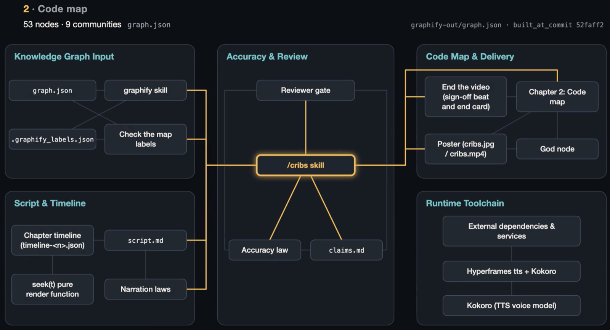

# /cribs

**MTV Cribs for your codebase. Every claim sourced.**

`/cribs` is a Claude Code skill that gives a repository the house tour: a narrated explainer video that walks a newcomer through what the project is and how the code is laid out. You run one command in a repo and get a video back.

What sets it apart is that it has to be right. Every claim the video shows or says is traced to a `file:line` or a node in the repo's knowledge graph and recorded in `claims.md`. Before anything renders, a reviewer with no prior context checks every row against the code.

## Watch it

[](docs/media/cribs-tour.mp4)

[▶ cribs gives itself the tour (1:36)](docs/media/cribs-tour.mp4): `/cribs` run on this repo. It covers what the skill is, then a code map drawn from its own knowledge graph, with all 27 claims traced to a file and line.

## What you get

Run `/cribs` from a repo root. It writes a `cribs-output/` folder:

- `cribs.mp4`: the narrated video (1920×1080, 30fps), with its poster baked into frame 0 so thumbnails look right everywhere
- `cribs.jpg`: the poster
- `script.md`: the narration, beat by beat, with the claims each beat relies on
- `claims.md`: every claim and its source, so anyone can check the video against the code
- `share-copy.txt`: a caption you can post as-is

The current version (M1) covers two chapters, about 90–100 seconds:

1. **What it is:** what the repo does, who it's for, and why it's useful.
2. **Code map:** a map of the codebase drawn from its knowledge graph, revealed cluster by cluster as the narration names each one.

Planned: the life of a request through real code (M2), core abstractions (M3), and a real execution trace captured from a run (M4).

## How it works

1. **Inspect:** read the project and build a knowledge graph with [graphify](https://github.com/Graphify-Labs/graphify), so the code map comes from the code, not from a guess.
2. **Plan:** narration comes first. Write the script beat by beat, voice each beat with Kokoro, and measure it. The visuals are timed to the voice.
3. **Build, check, render:** each chapter is an HTML page where every frame is a pure function of time. A label check confirms every map label exists in the graph, a fresh reviewer checks every claim, and then each chapter renders separately and ffmpeg joins them.
4. **Deliver:** the poster goes into frame 0, and you get the share copy.

## Install

```bash
git clone https://github.com/jwolberg/cribs
ln -s "$PWD/cribs/skills/cribs" ~/.claude/skills/cribs
```

Restart Claude Code, then run `/cribs` in any repo.

## Requirements

- Claude Code (it uses subagents for graph extraction and claim review)
- The [graphify](https://github.com/Graphify-Labs/graphify) skill at `~/.claude/skills/graphify`
- Node.js 22+ (for `npx hyperframes tts` and a zero-dependency Chrome driver)
- Google Chrome (headless frame capture)
- FFmpeg on `PATH`
- [uv](https://docs.astral.sh/uv/) and Python 3.10 (a per-run venv for Kokoro)

## Credits

- Structure adapted from `/brag-slim` in [latent-spaces/brag](https://github.com/latent-spaces/brag) (MIT)
- Narration: Kokoro (v1.0 ONNX, via [kokoro-onnx](https://github.com/thewh1teagle/kokoro-onnx)) via [Hyperframes](https://hyperframes.heygen.com/) `tts`
- Knowledge graph: [graphify](https://github.com/Graphify-Labs/graphify)

## License

MIT. See [LICENSE](LICENSE).
