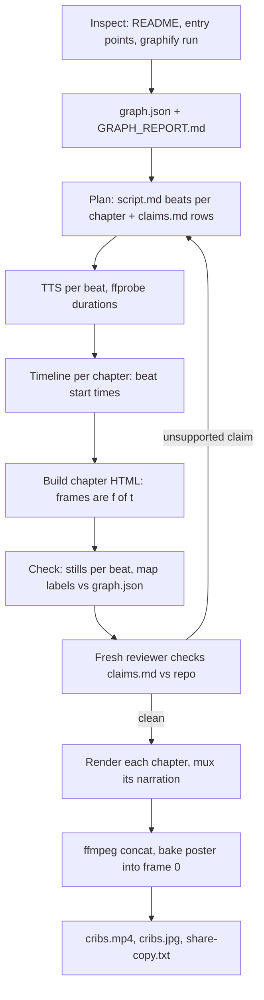

# /cribs M1 (chapters 1-2, narrated, end to end) - Plan

## Goal Capsule

- **Objective:** ship `skills/cribs/SKILL.md` so that `/cribs`, run in a repo, produces a ~90s narrated video of chapters 1 (What it is) and 2 (Code map), with every claim sourced.
- **Authority:** `plans/m1/HANDOFF.md` decisions are settled and win over this plan; this plan wins over implementer preference.
- **Target repo for the M1 proof run:** this repo (`brag`).
- **Stop conditions:** stop and ask if Kokoro TTS cannot run standalone (U2), if a change to `skills/brag*` looks necessary, or before any push.
- **Tail:** one local commit per ticket, validation gate before each, no push.

---

## Product Contract

### Summary

Add a sibling skill to `/brag-slim` that makes narrated code-explainer videos. M1 covers only chapters 1-2 (about 90 seconds) and proves the two new mechanisms: narration-timed visuals and an animated code map drawn from graphify output (see origin: plans/m1/HANDOFF.md).

### Problem Frame

`/brag` makes 20-second hype videos timed to music, where the main risk is being boring. An explainer is minutes long, timed to a voice, and its main risk is being wrong. Before building all five chapters, M1 must show that the pipeline (graph, script, audio, timed visuals, per-chapter render, join) works end to end on a real repo and that every on-screen claim traces to a source.

### Requirements

**Skill shape**
- R1. `skills/cribs/SKILL.md` is one self-contained file that follows `skills/brag-slim/SKILL.md`'s structure: Inspect, Plan, Build/check/render, Deliver.
- R2. `skills/brag*` files are not modified, and `skills/brag/slim.md` stays identical to `skills/brag-slim/SKILL.md`.

**Accuracy**
- R3. Every on-screen or narrated claim about the code has a row in `claims.md` with a `file:line` or graphify node source.
- R4. Every node and label in the code map exists in the graphify output (`graph.json`).
- R5. Before rendering, a reviewer subagent with no prior context checks `claims.md` against the repo and reports no unsupported claims.

**Narration and timing**
- R6. Narration is written first, synthesized with Kokoro (`npx hyperframes tts`), measured, and the visuals are timed to the measured audio.
- R7. Each chapter renders separately and ffmpeg joins them into one video.

**Deliverables**
- R8. Output lands in `cribs-output/` (timestamped sibling if it exists): `cribs.mp4` (chapters 1-2 with narration, about 90s), `script.md`, `claims.md`, `cribs.jpg` (baked in as frame 0), and `share-copy.txt`.

### Acceptance Criteria (M1 done-when, from the handoff)

- AC1. `/cribs` in a target repo produces `cribs-output/cribs.mp4` (chapters 1-2 with narration), plus `script.md`, `claims.md`, `cribs.jpg` (baked into frame 0), and `share-copy.txt`.
- AC2. Every node and label in the code map exists in the graphify output, and every claim in `claims.md` has a source.
- AC3. A reviewer subagent with no prior context has checked `claims.md` against the repo and found no unsupported claims.
- AC4. `node scripts/check-docs.mjs && node scripts/check-brag-slim.mjs` still pass.

### Scope Boundaries

- Chapters 3-5 are out: M2 adds chapter 3, M3 chapter 4, M4 chapter 5 (trace capture, SQLite first).
- No `.claude/skills/cribs`, `.agents/skills/cribs`, `.opencode/skills/cribs` symlinks, README, PRODUCT.md, or `docs/` changes until `/cribs` goes public after M1.
- No bundled scripts or assets in `skills/cribs/`; like brag-slim, the running model writes any helper it needs into `work/`.
- No music. Narration drives the soundtrack in M1.

---

## Planning Contract

### Key Technical Decisions

- KTD1. **One TTS call per narration beat, not per chapter.** Each beat (one sentence or two) becomes its own WAV, measured with `ffprobe`. The sum of beat durations plus fixed gaps is the chapter timeline, so visuals can cue on exact beat starts without forced alignment. Chapter audio is the beats concatenated with the gaps.
- KTD2. **Kokoro via `npx hyperframes tts`, default voice `af_heart`.** (session-settled: user-directed — chosen over macOS `say` and a hosted API: already used by `/brag --voice`, local, better quality.) U2 verifies it runs without a Hyperframes composition before anything depends on it.
- KTD3. **graphify owns the code map.** The skill runs graphify on the target repo, then picks the map's clusters from graphify's communities and its nodes from each community's highest-degree nodes. Labels are copied from `graph.json`, never paraphrased. A throwaway check in `work/` asserts every map label is in `graph.json` (R4).
- KTD4. **Map drawn as inline SVG, revealed cluster by cluster.** Positions are computed once and stored in the chapter's HTML; each frame is a pure function of time, and a cluster's reveal is cued to the narration beat that names it (per KTD1). This follows the user's standing preference for plain SVG over graph libraries.
- KTD5. **`claims.md` is a table: id, claim as shown or spoken, chapter and beat, source.** Sources are `file:line` or `graph.json` node id. `GRAPH_REPORT.md` is orientation only and is never a claim source. The reviewer gets the table and the repo path, not the script's reasoning (R5).
- KTD6. **Chapters render to identical encode settings** (1920x1080, 30fps, H.264, AAC 48kHz) so the ffmpeg concat demuxer can join them without re-encoding; the poster is then baked into frame 0 of the joined file, as brag-slim does.
- KTD7. **graphify output stays at the target repo's `graphify-out/`**, where graphify writes it and where its query fast path looks. The skill copies `graph.json` into `work/` for the run. This repo gitignores `graphify-out/` since it is the M1 target.
- KTD9. **Keep media out of the graph with `.graphifyignore`, not `.gitignore`.** graphify reads both files. This repo tracks ten demo mp4s under `examples/` and `docs/`, and graphify would transcribe them. Ignoring them in `.gitignore` would also stop new gallery videos from being added, so the skill checks graphify's detect output for video or audio and, if any is found, writes a `.graphifyignore` in the target repo before extraction and tells the user.
- KTD8. **Implementation notes live at `plans/m1/implementation-notes.md`**, not `docs/`, because `docs/` is the GitHub Pages root. Logged as the first notes entry.

### High-Level Technical Design

Pipeline per `/cribs` run. Chapters render independently, so a bad chapter is redone alone.



### Target timing

About 90s total: chapter 1 about 35s (4-6 beats), chapter 2 about 55s (one intro beat, one beat per cluster for 4-6 clusters, one closing beat). Measured narration sets the final length; these are planning targets, not hard caps.

### Assumptions

- The brag repo is thin on code (mostly Markdown skills plus two scripts), so its graph leans on graphify's semantic extraction of docs. Scope the graphify run to source and docs, not the committed mp4s under `examples/` and `docs/`, so no video transcription runs.
- graphify refuses to shrink an existing `graph.json`, so the first scoped run must be right. A wrong first run needs `--force` to redo.
- Frames are captured with headless Chrome (the Chrome app is installed; no Playwright cache). The exact capture tool is chosen at execution time, as brag-slim leaves it to the model.
- The M1 run happens in this session with the skill installed by symlink; the user approved Claude creating `~/.claude/skills/cribs`.

### Risks

| Risk | Mitigation |
|---|---|
| `npx hyperframes tts` needs a composition or fails standalone | U2 tests it first; on failure, stop and ask (KTD2 is settled, a fallback is a dependency change) |
| First `npx hyperframes` run downloads Kokoro weights slowly | U2 absorbs the download; record time and size in the notes |
| graphify communities on a small repo are too few or too noisy for a good map | Skill allows merging tiny communities and dropping isolated nodes, but only using graph.json labels (KTD3) |
| The model paraphrases a node label or invents a call path | KTD3 label check plus the R5 reviewer gate before render |
| Concat fails on mismatched streams | KTD6 fixed encode settings; verify with `ffprobe` per chapter before joining |

---

## Output Structure

```text
.graphifyignore                         # keeps demo media out of graphify (KTD9)
skills/cribs/SKILL.md                   # the skill (only new tracked skill file)
plans/m1/plan-m1.md                     # this plan
plans/m1/implementation-notes.md        # running notes
cribs-output/                           # per run, gitignored
  cribs.mp4  cribs.jpg  script.md  claims.md  share-copy.txt
  work/  graph.json  audio/  chapters/  frames/  stills/  review.md
```

---

## Implementation Units

### U1. Housekeeping: commit handoff, gitignore, start notes

- **Goal:** land the handoff and this plan, ignore run output, open the notes file.
- **Requirements:** R8 (output location), KTD7, KTD8.
- **Dependencies:** none.
- **Files:** `plans/m1/HANDOFF.md`, `plans/m1/plan-m1.md`, `.gitignore`, `.graphifyignore` (new), `plans/m1/implementation-notes.md` (new).
- **Approach:**
  1. Add `**/cribs-output*/` and `graphify-out/` to `.gitignore`, next to the `brag-output*/` rule.
  2. Add `.graphifyignore` excluding `*.mp4`, images, and `docs/` (the Pages site), per KTD9.
  3. Start the notes with dated entries for the `docs/` deviation (KTD8), the three answered open questions, and the `graphify-out/` ignore.
- **Test expectation:** none -- config and docs only.
- **Verification:** `git status` shows no stray files after a dummy `cribs-output/x`; the validation gate passes.

### U2. Verify Kokoro TTS runs standalone

- **Goal:** prove `npx hyperframes tts` produces a WAV from one sentence outside any Hyperframes composition, and measure it.
- **Requirements:** R6, KTD1, KTD2.
- **Dependencies:** U1.
- **Files:** `plans/m1/implementation-notes.md`.
- **Approach:** synthesize two short test sentences into the scratchpad, measure each with `ffprobe`, and record the exact working command, voice, sample rate, first-run download cost, and per-sentence latency in the notes.
- **Execution note:** smoke check, not code. If it fails, stop and ask before choosing a fallback.
- **Test scenarios:**
  - One sentence produces a non-empty WAV whose `ffprobe` duration is between 1s and 10s.
  - A sentence with code tokens (`graph.json`, `SKILL.md`) is spoken intelligibly; note any pronunciation fixes the script must apply.
- **Verification:** notes contain the working command and measured numbers.

### U3. SKILL.md skeleton, Inspect step, and the accuracy contract

- **Goal:** create `skills/cribs/SKILL.md` with frontmatter, usage, output layout, the accuracy rule, and the Inspect step (README, entry points, graphify run).
- **Requirements:** R1, R2, R3, R8, KTD5, KTD7, KTD9.
- **Dependencies:** U1.
- **Files:** `skills/cribs/SKILL.md` (new).
- **Approach:**
  1. Mirror brag-slim's opening: what it makes, options table (only `--voice <kokoro voice>`, default `af_heart`; landscape 1920x1080 is fixed in M1), output folder rule.
  2. State the accuracy law and the `claims.md` table format (KTD5).
  3. Inspect: read README and entry points, check graphify's detect output for media and add a `.graphifyignore` if needed (KTD9), run graphify, copy `graph.json` to `work/`, and answer the chapter-1 questions (what it is, who it's for, why useful), each answer sourced.
- **Patterns to follow:** `skills/brag-slim/SKILL.md` sections 1 and 4, tone and density.
- **Test expectation:** none -- prose skill; proven end to end in U7.
- **Verification:** the gate passes; no file under `skills/brag*` changed.

### U4. Plan step: narration-first script and timeline

- **Goal:** add the Plan step: `script.md` with beats per chapter, TTS per beat, measured timeline.
- **Requirements:** R3, R6, KTD1, KTD2.
- **Dependencies:** U2, U3.
- **Files:** `skills/cribs/SKILL.md`.
- **Approach:**
  1. Script format: per chapter, numbered beats, each with narration text, the on-screen element it cues, and the `claims.md` ids it relies on.
  2. Synthesize each beat, measure it, and write a timeline (beat start, duration) per chapter into `work/`.
  3. Narration laws for explainers: plain spoken sentences, say identifiers the way U2 found they sound best, no claim without a claims row.
- **Test expectation:** none -- prose skill; proven in U7.
- **Verification:** the gate passes; the step names the exact TTS command recorded in U2.

### U5. Chapter visuals: chapter 1 and the animated code map

- **Goal:** add the build guidance for chapter 1 and for chapter 2's SVG code map, including the label check.
- **Requirements:** R4, KTD3, KTD4.
- **Dependencies:** U4.
- **Files:** `skills/cribs/SKILL.md`.
- **Approach:**
  1. Chapter 1: title, one-line what-it-is, who it's for, the project's own identity (colors, fonts) as brag-slim does, each element cued to its beat.
  2. Chapter 2: choose clusters and nodes from graphify communities and degree (KTD3), lay out in inline SVG, reveal cluster by cluster on beat starts (KTD4), labels copied verbatim.
  3. Before rendering, write and run a check in `work/` that every SVG label exists in `graph.json`.
- **Test expectation:** none -- prose skill; the label check itself runs in U7.
- **Verification:** the gate passes.

### U6. Build/check/render, reviewer gate, join, and deliver

- **Goal:** add the render and delivery steps: stills check, fresh reviewer gate, per-chapter render, ffmpeg join, poster, share copy.
- **Requirements:** R5, R7, R8, KTD5, KTD6.
- **Dependencies:** U5.
- **Files:** `skills/cribs/SKILL.md`.
- **Approach:**
  1. Stills at every beat start and mid-reveal; fix overflow and contrast (brag-slim section 3).
  2. Spawn a reviewer subagent with no prior context, giving it `claims.md` and the repo path and asking it to mark each row supported or unsupported with evidence into `work/review.md`. Fix and re-run until clean.
  3. Render each chapter with its narration to KTD6 settings, join with the concat demuxer, bake the poster into frame 0, write `share-copy.txt`.
- **Test expectation:** none -- prose skill; proven in U7.
- **Verification:** the gate passes; the skill reads top to bottom as one runnable procedure.

### U7. Install and run M1 on this repo

- **Goal:** symlink the skill, run `/cribs` on the brag repo, and verify the done-when criteria with fresh eyes.
- **Requirements:** AC1-AC4.
- **Dependencies:** U6.
- **Files:** `plans/m1/implementation-notes.md`, plus any `skills/cribs/SKILL.md` fixes the run exposes.
- **Approach:**
  1. `ln -s` `skills/cribs` into `~/.claude/skills/cribs` (approved by the user).
  2. Run the skill end to end in this repo into `cribs-output/`.
  3. Separately from the skill's own gate, spawn a new reviewer subagent with only the acceptance criteria, `claims.md`, `graph.json`, and the repo, and have it verify AC2 and AC3.
  4. Record the run (length, durations, review verdict, fixes made to SKILL.md) in the notes.
- **Execution note:** this is the unit's proof; every SKILL.md fix found here is part of this ticket.
- **Test scenarios:**
  - Covers AC1. All five deliverables exist; `ffprobe` shows one video and one audio stream and a duration of about 90s.
  - Covers AC1. Frame 0 of `cribs.mp4` matches `cribs.jpg`, and the duration equals the pre-poster duration.
  - Covers AC2. The label check passes: every code-map label is found in `graph.json`.
  - Covers AC2 / AC3. The fresh reviewer marks every `claims.md` row supported with a cited location.
  - Covers AC4. The validation gate passes.
- **Verification:** the reviewer's report is saved in `cribs-output/work/` and summarized in the notes; the user can watch `cribs.mp4`.

---

## Verification Contract

| Gate | Command or check | When |
|---|---|---|
| Repo validation | `node scripts/check-docs.mjs && node scripts/check-brag-slim.mjs` | before every commit |
| brag untouched | `git diff --stat main -- skills/brag skills/brag-slim` is empty | before every commit |
| TTS smoke | working `npx hyperframes tts` command and measured durations in notes | U2 |
| End-to-end | AC1-AC4 checked on this repo, reviewer report saved | U7 |

---

## Definition of Done

- AC1-AC4 hold on the brag repo, with evidence in `plans/m1/implementation-notes.md`.
- Seven commits, one per unit, none pushed.
- No leftover experiments in the diff: only `skills/cribs/SKILL.md`, the plans folder, `.gitignore`, and `.graphifyignore` changed.
